# **CMCFlow**

## T3A2-B - Real World App (Part B)

## Please install watchman if you are using MAC, 'brew install watchman' or 'brew upgrade watchman'

## Purpose

Studies into the increasing number of those with mental health concerns have shown a possible link between:

1. Increased _exposure_ to technology

2. Decrease in one's _mental state_.

Through habit-building and built-in personable reports tracking, _CMCFlow_ will assist people in beginning their journey into meditation which has proven positive effects on mental state.

## Functionality / Features

- User registration
- A quiz for new students
- Meditation courses
- Tracking the student's progress
- Student Rewards - Reward badges will unlock upon completion of courses, or hitting milestones

## Target Audience

_CMCFlow_ is targeted at people who have little to no experience in meditation but would like guidance and a metric to gauge effect.

## Tech Stack

This application will be written entirely in _Javascript_ and divided into two distinct sections:

#### The back end:

- Node.js
- Express
- MongoDB
- Atlas

Including the libraries:

- Sengrid: Delivers transactional (password reset) emails through the world's largest cloud-based email delivery platform
- Axios: Promise based HTTP client for the browser and node.js, making API calls easier.
- Bcrypt: A a password hashing library used to enhance user security.
- Coveralls: Provides a user interface to easily show which areas of our code isn't covered by tests.
- Passport: Passport is authentication middleware for Node.js, enabling certain API access to be allowed or rejected based on if the user is authenticated or not. 
- Passport-facebook: Passport for facebook allows a simple one-click login for the user by using their facebook account. 
- Passport-google-oauth20: Passport for google allows a simple one-click login for the user by using their facebook account. 
- Passport-jwt: A json web token library that integrates with passport.  
- Stripe: Stripe payments is used to allow users to donate money to CMCflow. 
- Supertest: Provides a high-level abstraction for testing HTTP requests from express, used in combination with Jest.
- Concurrently: Allows us to run multiple commands concurrently. In our application we run both the backend server and the front end client at the same time with "npm run dev".
- Jest: A javascript testing framework, used for testing the backend.
- Nodemon: A tool that helps develop node.js based applications by automatically restarting the node application when file changes in the directory are detected.

#### The front end:

React
Including libraries:

- _redux_

  Redux is a state management library for our meditation app. It is the central location of state that is needed for our components in react.

- _react-redux_

  React-redux is a library which provide the binding between redux and our react application. It has a higher order function called 'connect' that allows react component to interact with redux.

- _redux-thunk_

  It is a redux middleware that handles async actions between our app and redux in particular about changing the state in redux.

- _axios_

  This library is a promise based HTTP client for our react application when we need to make our api call to our server.

- _bootstrap_

  Bootstrap is an open source library for styling web applications. It provides responsive solution to HTML and ready to use styling.

- _fetch-mock_

  fetch-mock allows mocking http requests for unit test that involves redux and action creators.

- _jwt-decode_

  A library that determines if a jwt received is valid or not, used for authentication.

- _moment_

  This library parse, validate, manipulate, and display dates and times in JavaScript.

- _moxios_

  Mock axios requests for testing, intercept all axios request during test so we can run fake api calls.

- _mutationobserver-shim_

  A library that was used in our app in conjunction with react-hook-form for testing.

* _node-sass_

  Node-sass is a library that provides binding for sass files in our app to make it work with CRA.

* _react_

  React is a JavaScript library for creating user interfaces. This is what makes this application work in the first place.

- _react-router-dom_

  Enables routing in our web applications.

- _react-circular-progressbar_

  Style the main component of our app in terms of meditation progress.

- _react-dom_

  This package serves as the entry point to the DOM and server renderers for React. It is intended to be paired with the generic React package, which is shipped as react to npm.

- _react-hook-form_

  A form library that handles simple form in our application.

- _react-scripts_

  This package includes scripts and configuration used by Create React App for app development.

- _react-stripe-checkout_

  Makes payment possible with Stripe payment service from a front end application.

- _react-youtube_

  Simple React component acting as a thin layer over the YouTube IFrame Player API.

- _reactstrap_

  A react ui library that make it easy to use Bootstrap 4 components

- _redux-form_

  Utilized to manage our form state in Redux especially with our wizard form.

- _redux_mock_store_

  A mock store for testing Redux async action creators and middleware. The mock store will create an array of dispatched actions which serve as an action log for tests.

## DataFlow Diagram

---

## Application Architecture Diagram

---

## User Stories

<table style="width:100%">
    <tr>
      <th>User Stories</th>
      <th>Acceptance Criteria</th>
    </tr>
    <tr>
      <td>As a user I want to register or login to the website because I want to use the application</td>
      <td>
        <ul>
           <li>
            See an authentication page
           </li>
           <li>
            Able to go to the authentication page and either login or register
           </li>
           <li>
            Able see invalid input on the registration page
           </li>
           <li>
            Able to seen invalid input when trying to log in
           </li>
           <li>
           Have the option to authenticate by external providers like Facebook, Google
           </li>
           <li>
            Login to the app after registration
           </li>
        </ul>
      </td>
    </tr>
    <tr>
      <td>As a user I want to choose what type of meditation to do from the dashboard because I want the freedom to choose my course</td>
      <td>
        <ul>
          <li>
          Navigate to the discover page to choose meditation courses to start, i.e. “beginner”, “intermediate” or “expert”
          </li>
        </ul>
      </td>
    </tr>
    <tr>
      <td>As a user I want to continue where I left off from the previous meditation session because I can resume where I left off from the last session without extra navigation work</td>
      <td>
        <ul>
          <li>
            See options on the page to choose "resume"
          </li>
        </ul>
      </td>
    </tr>
    <tr>
      <td>As a user I want see a dashboard page because I want a centralized location to visualize my profile, data, past achievements and do operations related to the application</td>
      <td>
        <ul>
          <li>
            See a timeline of the type of meditation I have done
          </li>
          <li>
            See a personalized message for motivation
          </li>
          <li>
            click on button to start the meditation session
          </li>
          <li>
            see a button to initiate an one time only donation
          </li>
        </ul>
      </td>
    </tr>
    <tr>
      <td>As a user I want to see a donation confirmation page because I want to know if a payment has gone through or not.</td>
      <td>
        <ul>
          <li>
            See a payment success page after inputting credit card details
          </li>
        </ul>
      </td>
    </tr>
    <tr>
      <td>As a user I want to see past donations because I want to know the history of my contribution to the application</td>
      <td>
        <ul>
          <li>
            See a a component that lists the donations
          </li>
          <li>
            On the donation component, can see the time, the amount and the details of the donations.
          </li>
        </ul>
      </td>
    </tr>
    <tr>
      <td>As a user I want to see an About page because I want to find out more about the app before registering.</td>
      <td>
        <ul>
          <li>
            See a description of the app
          </li>
        </ul>
      </td>
    </tr>
    <tr>
    <td>As a user I want to see stats based on my performance so far on time meditated, run-streak, sessions completed and last time meditated because I want to know what I have achieved and at the same time stay motivated</td>
    <td>
      <ul>
        <li>
          See my awards / badges / achievements unlocked
        </li>
      </ul>
    </td>
    </tr>
    <tr>
      <td>As a user I want to get a timer component for the meditation session because that's the basic feature of any meditation apps, I need to know when it finishes and if I need to pause or resume I can do it.</td>
      <td>
        <ul>
          <li>
            Be able to play, pause and resume the meditation
          </li>
          <li>
            Get notified that a meditation is finished with a notification of audio
          </li>
          <li>
            Repeat the meditation again or get redirected back to the dashboard to choose a new meditation session
          </li>
        </ul>
      </td>
    </tr>
</table>

---

## Wireframes

Wireframes for multiple standard screen sizes, created using industry standard software

**Interactive Wireframes for website**

To view interactive wireframes showing relationships between screens, intended actions and content prioritisation:

[Interactive Figma Wireframes](https://www.figma.com/proto/jMT92SwJQZLZzjR2GpOHlQ/MeditationApp_Interactive?node-id=1%3A78&scaling=min-zoom)

**Website Size**

**iPad Size**

Landing:

Home:

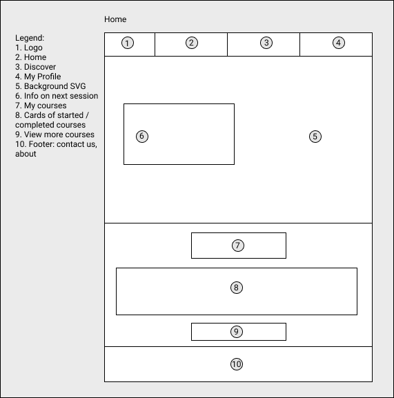

Meditation App Popup:

Discover:

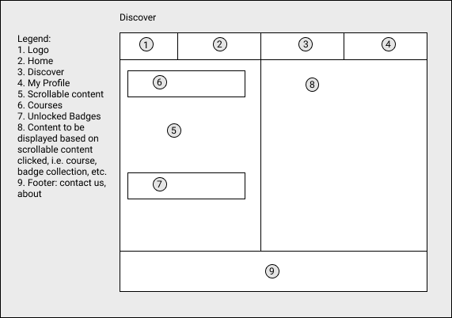

Discover - Specific Course:

My Profile - Stats:

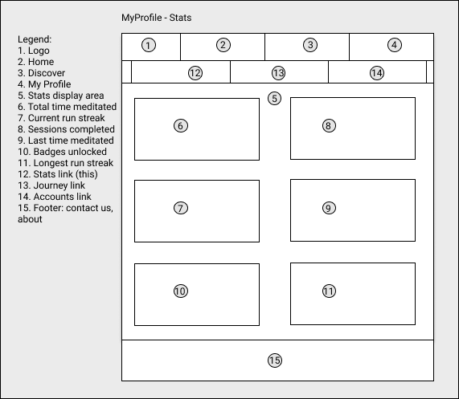

My Profile - Journey:

My Profile - Journey Popup:

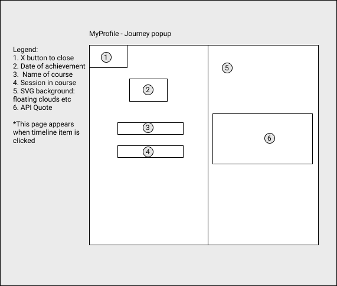

MyProfile - Account:

**Mobile Size**

Landing:

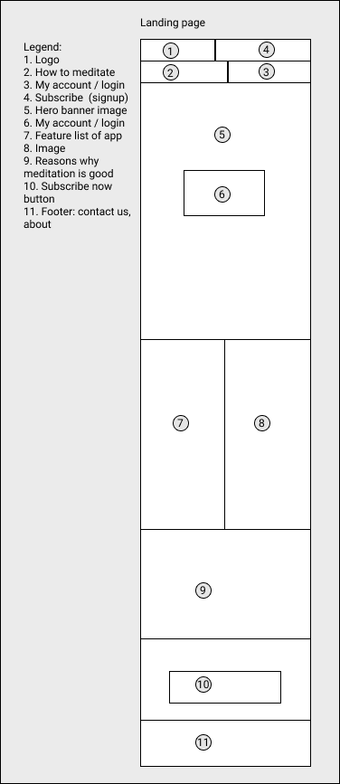

Home:

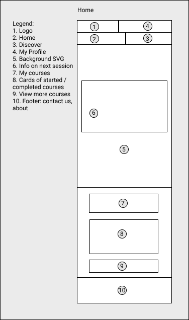

Meditation App Popup:

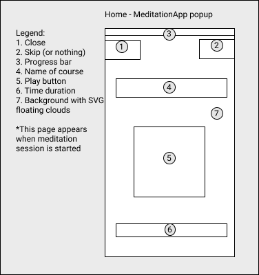

Discover:

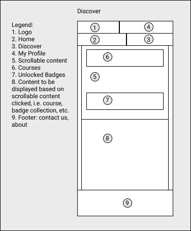

Discover - Specific Course:

My Profile - Stats:

My Profile - Journey:

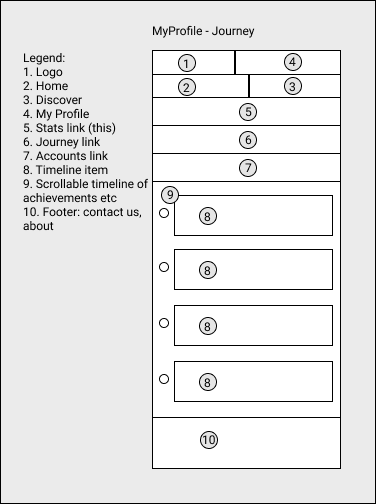

My Profile - Journey Popup:

MyProfile - Account:

---

## Agile methodology

https://trello.com/b/7fbHxovo/mern-project-part-b

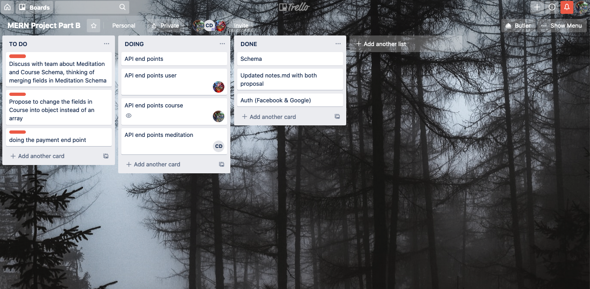
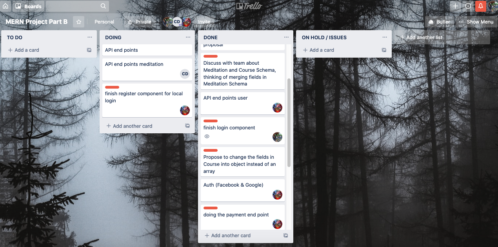

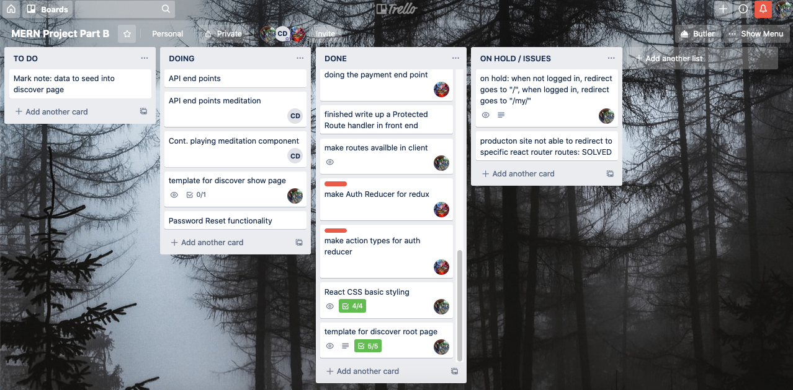
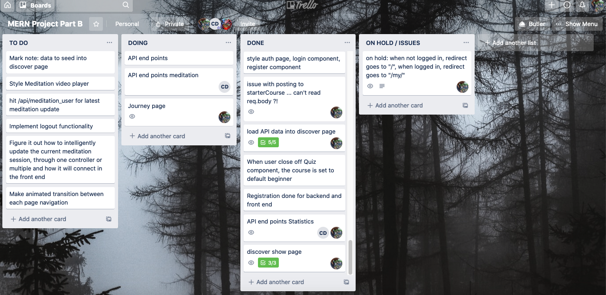
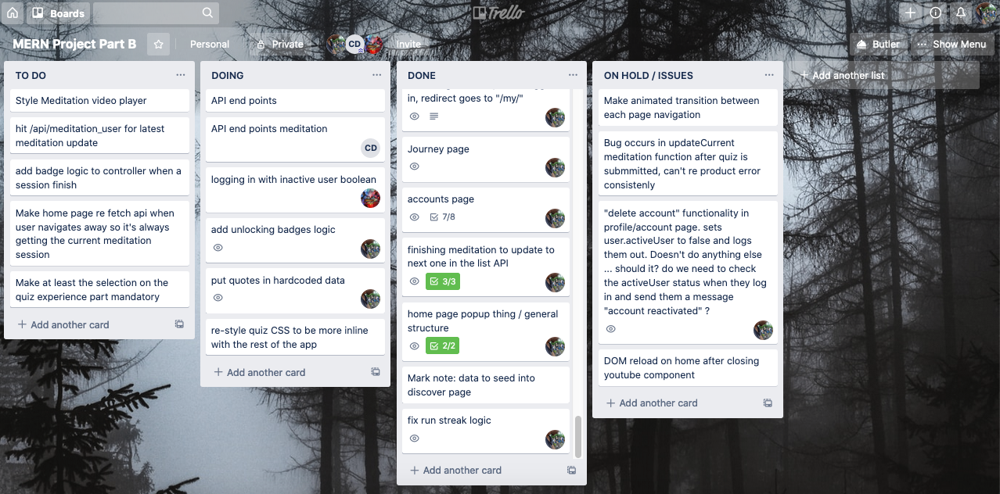
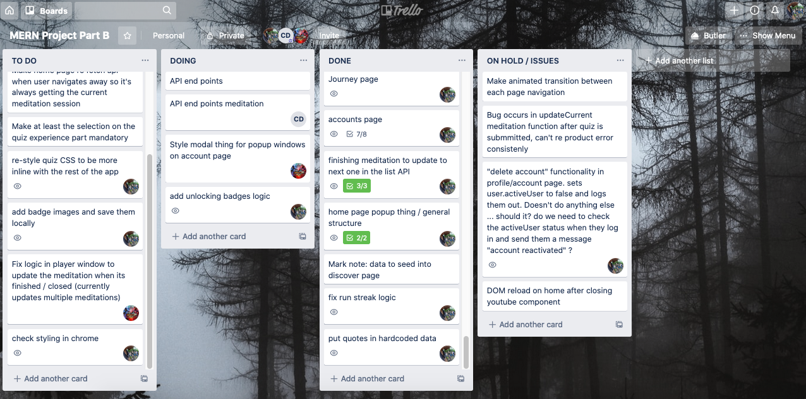
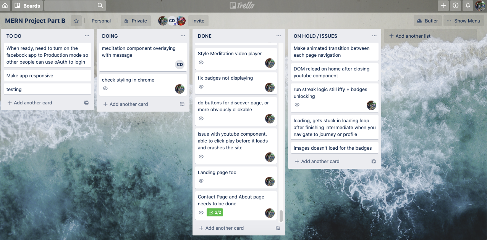
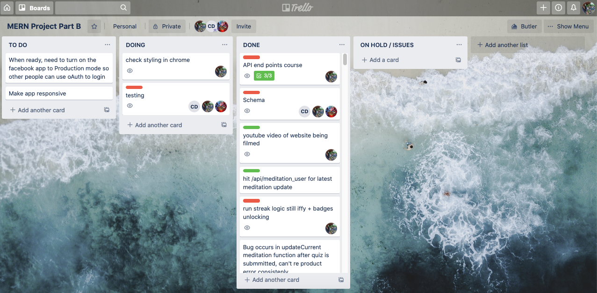

# **R1** At a minimum use the following technologies: Mongo / Mongoose Express React.js Node.js

[click here](#tech-stack)

# **R2** Write well designed code that: Separates the program into modules that each deal with one particular focus, or concern; Demonstrates DRY (Don’t Repeat Yourself) coding principles; Uses appropriate libraries; Demonstrates good code flow control for user stories; Applies Object Oriented (OO) principles/patterns; Uses appropriate data structures

# **R3** Employ and utilise proper source control methodology (git)

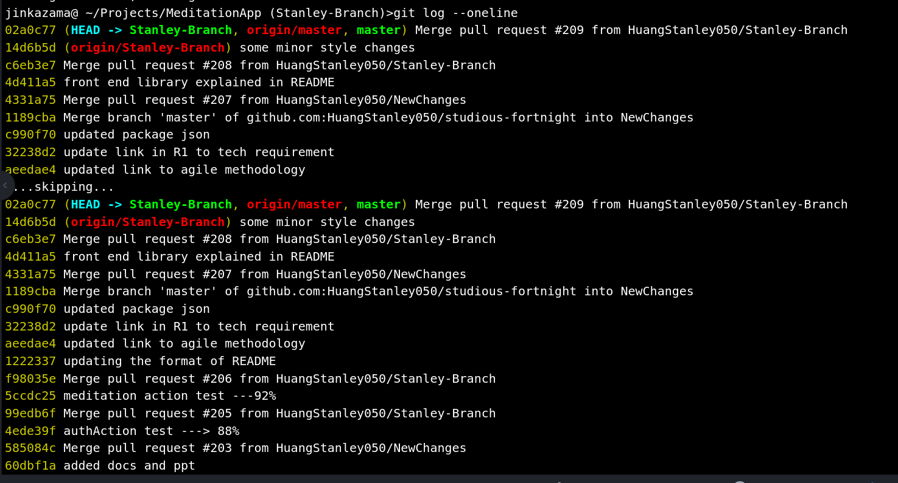

# **R4** Demonstrate your ability to work in a team: Use a recognised project management methodology; Use a recognised task delegation methodology

[click on this link](#agile-methodology)

# **R5** Produce a working application that meets client and user needs

# **R6** Deploy the application to a cloud hosting service

# **R7** Produce an application with an intuitive user interface

# **R8** Provides evidence of user testing: In the development environment and In the production environment

**Development testing**

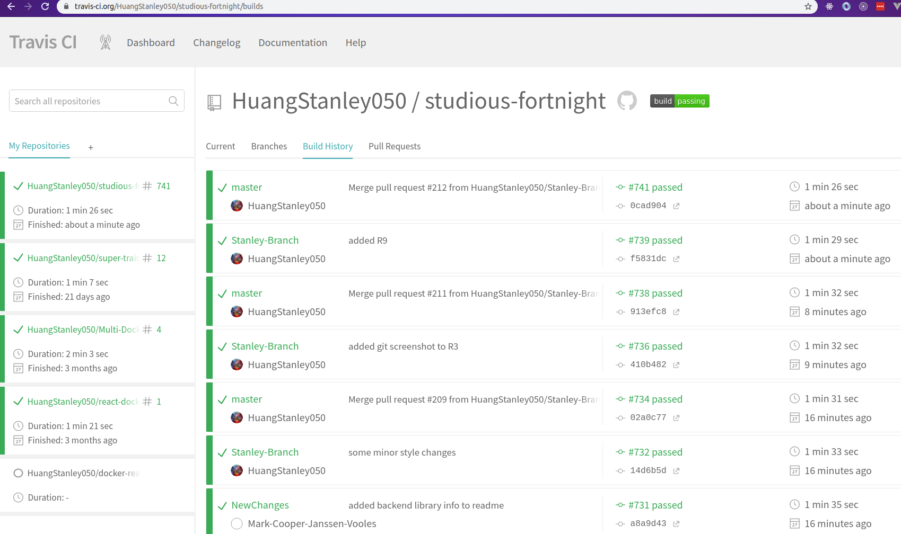

**Production testing**

# **R9** Utilises a formal testing framework

**Jest**

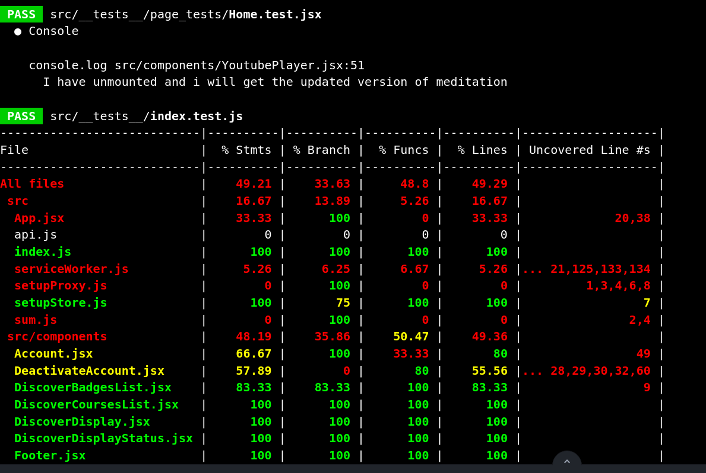

# **R10** A link (URL) to your deployed website

Link to deployed site [site](https://meditation-chill.herokuapp.com/)

# **R11** A link to your GitHub repository (repo)

Link to github repo [repo](https://github.com/HuangStanley050/studious-fortnight)

# R12
